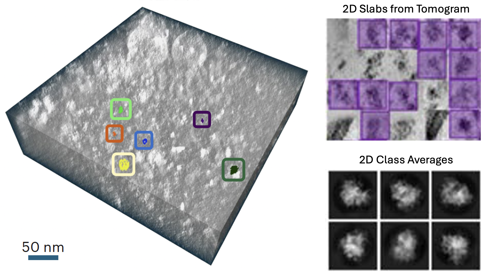
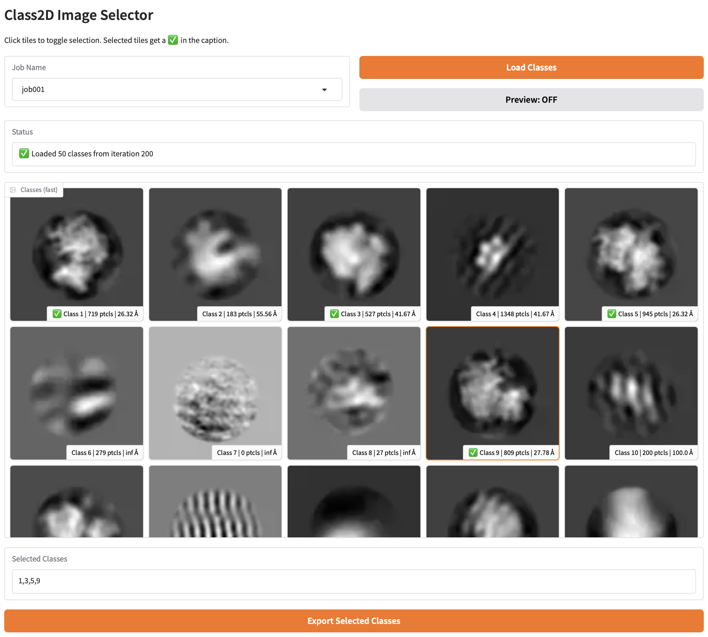
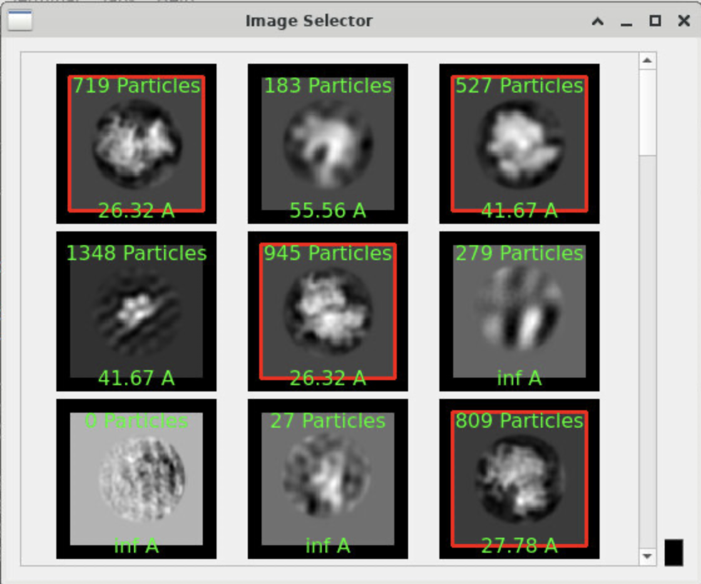

# 2D Slab Classification Workflow

A comprehensive guide to running automated 2D class averaging on extracted slabs from cryo-ET tomograms. 

## Overview

The 2D slab classification workflow in py2rely enables high-throughput 2D class averaging on extracted "slabs" (thin slices) from tomograms. This workflow is particularly useful for:

- 🔍 **Rapid particle validation**: Quickly assess particle quality
- 🎯 **Template generation**: Create 2D templates for template matching
- 🧹 **Particle cleaning**: Remove false positives and low-quality picks



The complete workflow consists of three main steps:

1. **Slab Extraction** - Extract thin slabs from tomograms at particle locations
2. **2D Classification** - Run Relion Class2D on extracted slabs
3. **Visualization & Selection** - View and extract class averages


## Prerequisites

Before starting, ensure you have:

- ✅ Installed `gradio` or `PyQt5` for visualization (see [Installation](../getting-started/installation.md))
- ✅ Prepared particle coordinates and tomogram data
- ✅ Access to SLURM cluster (recommended for large datasets)

!!! question "Do I need visualization tools?"
    Yes! The 2D slab workflow requires either Gradio or PyQt5 for viewing and selecting class averages. See the [Installation Guide](../getting-started/installation.md) for setup instructions.

## Step 1: 🔪 Extract Slabs

Project slabs from tomograms at particle coordinates using [`slabpick`](https://github.com/apeck12/slabpick). `py2rely` can either generate the relevant CLI inputs to run the job through a SLURM scheduler, or users can use the corresponding `slabpick` commands: 

=== "Direct Call"

    The `slabpick` commands to generate slabs from tomograms is shown below, we will be calling both:
    1. `make_minislabs` 
    2. `normalize_stack`
    For generating the slabs and normalizng the contrast for Relion.
    
    ```bash
    make_minislabs \
        --in_coords=/path/to/copick/config.json \
        --extract_shape 500 500 400 \
        --coords_scale 1.0 --col_name rlnMicrographName \
        --voxel_spacing 5.0 --tomo_type denoised \
        --user_id octopi --particle_name ribosome

    normalize_stack \
        --in_stack=/path/to/output/particles.mrcs \
        --out_stack=/path/to/output/particles_relion.mrcs \
        --apix 1.54
    ```

=== "SLURM Submission"

    The command below will create and submit a SLURM job to extract slabs according to the specified parameters:

    
    ```bash
    # Create the Slurm Submission script for minislab generation
    py2rely-slurm slab slabpick \
        --in-coords /path/to/copick/config.json \
        --pixel-size 1.54 \
        --extract-shape 500,500,400 \
        --tomo-type denoised --voxel-spacing 10.0 \
        --particle-name ribosome --user-id octopi

    # Run Minislab Extraction
    sbatch slabpick.sh  
    ```
        
    <details markdown="1">
    <summary><b>📋`py2rely-slurm slab slabpick` Parameters</b></summary>

    | **Parameter**       | **Description**                                            | **Example**                |
    |---------------------|------------------------------------------------------------|----------------------------|
    | `--in-coords` *     | Input coordinates file (particles picks, e.g. STAR format). *(Required)* | `input/full_picks.star`    |
    | `--in-vols`         | Input volumes file (list of tomograms, e.g. STAR file).    | `input/tomograms.star`     |
    | `--out-dir` *       | Directory to save extracted slabs. *(Required)*            | `slabs/`                   |
    | `--extract-shape` * | Slab dimensions (X,Y,Z) in **pixels** (comma-separated). *(Required, default: 500,500,400)* | `"500,500,400"`             |
    | `--coords-scale` *  | Scale factor to convert input coordinates to Angstroms. *(Required)* <br>*(Use 1.0 if coordinates are already in Å or from CoPick output.)* | `1.0`                      |
    | `--voxel-spacing`   | Voxel size of the tomograms in Angstroms (Å). *(Default: 5)* | `10.0`                   |
    | `--pixel-size`      | Pixel size of the original tilt series in Å. *(Default: 1.54)* | `1.54`                  |
    | `--tomo-type`       | Tomogram file type/format (needed if using a CoPick project context). | `mrc`                      |
    | `--user-id`         | User ID for CoPick database query (if applicable).         | `$USER` (current user)     |
    | `--particle-name`   | Particle name for CoPick query (if applicable).            | `mix`                      |
    | `--session-id`      | Session ID for CoPick query (if applicable).               | `99`                       |
    | `--help`            | Show help message and exit.                                | (n/a)                      |

    *Parameters marked with * are required.* Defaults are used if optional parameters are not provided.
    </details>
    
!!! tip "Slab Size Guidelines"
    - **X, Y**: Should be 2-3× the particle diameter
    - **Z**: Typically 300-400 pixels (thinner = better alignment, but less context)
    
    !!! warning "Too Large vs Too Small"
        - **Too large**: Slower processing, more noise
        - **Too small**: May cut off particle features
        - **Just right**: 2-3× particle diameter in X/Y


## Step 2: 📊 Run Class2D

Classify the extracted slabs using Relion Class2D.

=== "Direct Call"

    ```bash
    py2rely slab class2d \
        --particles slabs/particles.star \
        --nr-classes 50 --nr-iter 25 \
        --particle-diameter 300
    ```

=== "SLURM Submission"

    For large datasets or GPU clusters:
    
    ```bash
    # Generate the Shell Submission Script for 2D Classificaiton
    py2rely-slurm slab class2d \
        --particle-diameter 300 \
        --num-classes 50 \

    # Run Class2D
    sbatch class2d.sh
    ```
    
    !!! success "Bootstrap Trials"
        The `--bootstrap-ntrials` option runs multiple independent classifications for robust class ranking (see Step 3).

??? note "📋 `class2d` Parameters"

    | Parameter | Description | Recommended |
    |-----------|-------------|-------------|
    | `--tau-fudge` | Regularization parameter | 2.0-4.0 |
    | `--nr-classes` | Number of classes | 20-100 |
    | `--class-algorithm` | Algorithm (`2DEM` or `VDAM`) | `2DEM` |
    | `--nr-iter` | Number of iterations | 20-30 |
    | `--do-ctf-correction` | Apply CTF correction | `yes` |
    | `--particle-diameter` | Particle diameter (Å) | Match your particle |
    | `--dont-skip-align` | Perform alignment | `yes` for better results |
    | `--use-gpu` | Use GPU acceleration | `yes` (if available) |

### Classification Output

The classification job creates:

```
Class2D/
└── job001/
    ├── run_it001_data.star
    ├── run_it002_data.star
    ├── ...
    ├── run_it025_data.star
    └── run_it025_classes.mrcs  # Final class averages
```

## Step 3: 🎨 Extract Classes

After classification, visualize class averages and extract the best classes. On both interfaces, users and select classes corresponding to the desired processed protein. 

=== "Web Interface (Gradio) 🌐"

    Launch an interactive web interface:
    
    ```bash
    py2rely slab extract
    ```

    !!! example "Hosting URL"

        This command will print a resulting message similar to as shown below:

        ```bash
        * Running on local URL:  http://127.0.0.1:7860
        * Running on public URL: https://09ef7b0f6f19b227ff.gradio.live
        ``` 
        The second link for the public URL can be ran on any computer (including outside the HPC environment).

        


=== "Desktop GUI (PyQt5) 🖥️"

    For a native desktop experience:
    
    ```bash
    py2rely slab extract-desktop \
        -j job001
    ```

    This will populate a PyQT application with an example is shown below...    

    

!!! success "Features"
    - 📸 Browse all class averages
    - 🎯 Select classes by clicking
    - 💾 Export selected particles to a new STAR file
    - 📊 View class statistics and scores
    - Interactive class browser with thumbnails
    - Real-time filtering and search
    - Batch selection tools

### Generate Summary Gallery

Create a static gallery of class averages:

```bash
py2rely slab summary \
    --particles slabs/particles.star \
    --class-job job001
```

Generates a PDF or image file showing all class averages in a grid layout.

### Iterative Refinement

Improve classification by iterating:

1. Run initial classification
2. Extract good classes
3. Re-classify selected particles with tighter parameters
4. Repeat until convergence

```bash
# First pass: broad classification
py2rely slab class2d \
    --particles slabs/particles.star \
    --nr-classes 100 \
    --nr-iter 20

# Extract good classes
py2rely slab extract
# Export to: slabs/selected_particles.star

# Second pass: refined classification
py2rely slab class2d \
    --particles slabs/selected_particles.star \
    --nr-classes 20 \
    --nr-iter 30 \
    --highres-limit 8.0
```

## Step 4: 📤 Exporting Back to Copick

After selecting good classes, you may want to write the curated particle set back into CoPick for reuse in downstream workflow: (e.g. 3D sub-tomogram averaging or further annotation).

This is done using rln_map_particles, which maps particles selected in RELION back to their original runs.
```bash
rln_map_particles \ 
    --rln_file Select/job002/particles.star \
    --map_file stack/particle_map.csv \
    --particle_name ribosome --user_id octopi \
    --user_id_out slabpick --session_id_out 1  session_id 1
```

??? note "📋 `rln_map_particles` Parameters"

     | Parameter | Description |
     |-----------|-------------|
     | `--rln_file` | RELION STAR file containing selected or rejected particles |
     | `--map_file` | Particle-to-slab bookkeeping file mapping slabs back to tomograms |
     | `--coords_file` | Original CoPick JSON file used to generate the slabs |
     | `--particle_name` | Input particle name used in the original CoPick query |
     | `--session_id` | Input CoPick session ID where the original coordinates were queried |
     | `--user_id` | Input CoPick user ID where the original coordinates were queried |
     | `--particle_name_out` | Particle name for the exported (curated) picks |
     | `--session_id_out` | CoPick session ID to write the curated particles to |
     | `--user_id_out` | CoPick user ID to write the curated particles under |
     | `--rejected_set` | Export rejected particles instead of selected ones |

## Example: Complete Workflow

```bash
# 1. Extract slabs (SLURM)
py2rely-slurm slab slabpick \
    --in-coords input/full_picks.star \
    --in-vols input/tomograms.star \
    --out-dir slabs/ \
    --extract-shape "128,128,32" \
    --voxel-spacing 10.0 \
    --pixel-size 1.54

# Run Minislab Extraction
sbatch slabpick.sh  

# 2. Run classification
# Generate the Shell Submission Script for 2D Classificaiton
py2rely-slurm slab class2d \
    --particle-diameter 300 \
    --num-classes 50 \

# Run Class2D
sbatch class2d.sh

# 3. Visualize and extract
py2rely slab extract

# 4. Export selected particles
# TODO...
```

## Next Steps

- Learn about [3D sub-tomogram averaging](../3d-subtomogram-averaging.md) for full reconstruction
- Explore [data import options](../importing-data.md) for preparing your data
- Check the [API reference](../../api-reference/overview.md) for advanced usage

