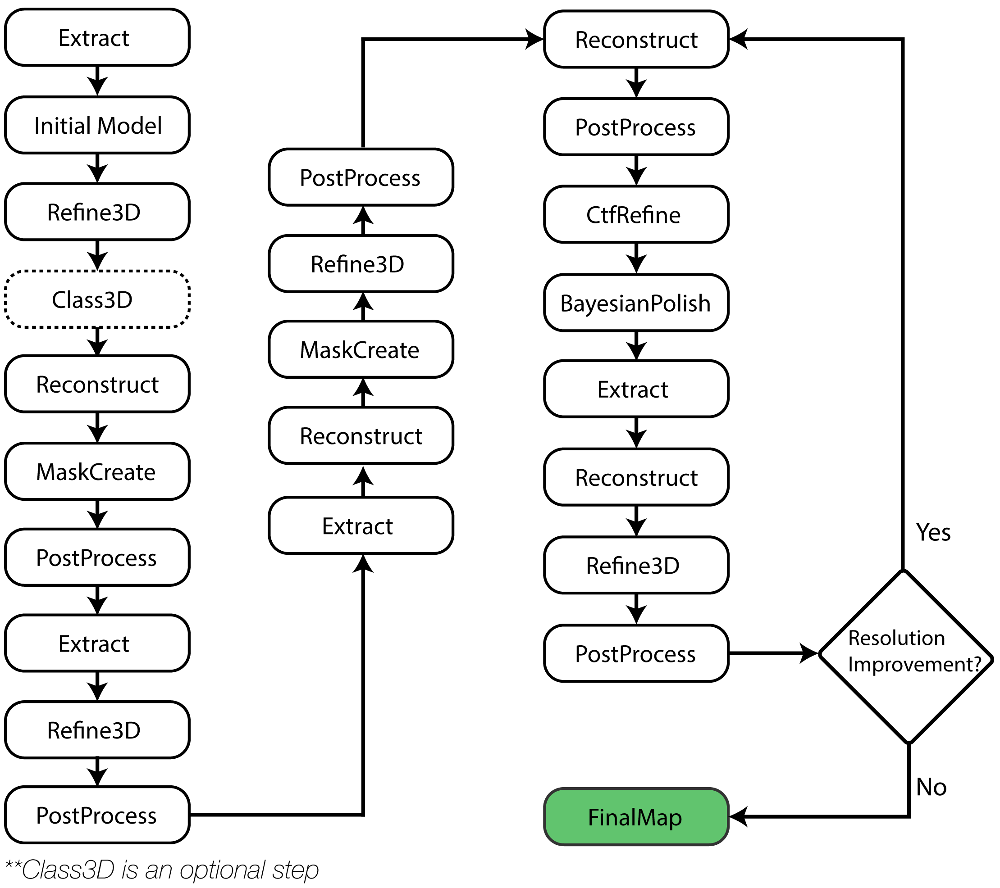
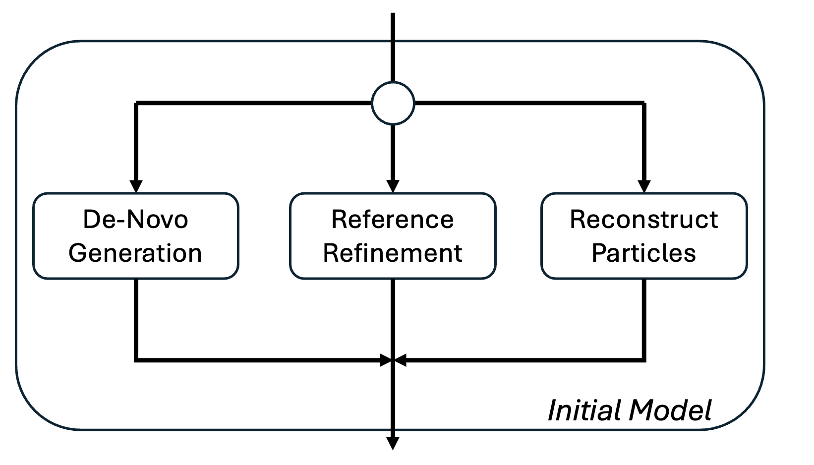

# 3D Sub-tomogram Averaging Workflow

A comprehensive guide to running automated sub-tomogram averaging with py2rely and Relion 5.0.

## Overview

The 3D sub-tomogram averaging (STA) workflow in py2rely automates the entire process from particle extraction to high-resolution reconstruction. The pipeline handles:

- ✅ Pseudo sub-tomogram extraction
- ✅ Initial model generation (de novo or from template)
- ✅ 3D classification (optional)
- ✅ CTF refinement and Bayesian polishing
- ✅ Post-processing and resolution estimation

## Workflow Steps

### 1. 📦 Data Preparation

Refer to the [Import Guide](importing-data.md) for generating the `aligned_tilt_series.star` and `full_picks.star` file.

### 2. ⚙️ Generate Pipeline Parameters

Create a parameter JSON file with default settings:

```bash
py2rely prepare relion5-parameters \
    -p input/24jan01_virus_like_particle.star \
    -ts input/tiltSeries/aligned_tilt_series.star \
    -ps 1.54 -lp 50 -pd 290 -bs 1.75 \
    -s C1 -bl 4,2,1
```

!!! info "What this command does:"

    This generates a comprehensive JSON file containing all RELION job parameters for the entire pipeline. Think of it as a "recipe" that defines:

    - Box sizes at each binning level
    - Refinement parameters (angular sampling, offset search)
    - CTF refinement settings
    - Post-processing options
    - Job dependencies and execution order

    ??? success "Knowing the box sizes per bin"

        ✅ After the parameters JSON file is complete, we will see an output such as this:

        ```bash
        [Initialize] Running Refinement Pipeline with Given Binnings and Resulting Box Sizes
        [Initialize] Box Size: 84 @ bin=4
        [Initialize] Box Size: 168 @ bin=2
        [Initialize] Box Size: 352 @ bin=1
        ```

        This will be necessary information when generating a template for the STA pipeline.

    ??? note "📋 `py2rely prepare relion5-parameters`"

        | Parameter | Short | Description | Default |
        |-----------|-------|-------------|---------|
        | `--output` | `-o` | Output path for parameter JSON file | `sta_parameters.json` |
        | `--tilt-series` | `-ts` | Path to tilt series STAR file | `input/tiltSeries/aligned_tilt_series.star` |
        | `--particles` | `-p` | Path to particles STAR file | `input/full_picks.star` |
        | `--tilt-series-pixel-size` | `-ps` | Tilt series pixel size (Å) | `1.54` |
        | `--symmetry` | `-s` | Particle symmetry (C1, C2, D2, etc.) | `C1` |
        | `--low-pass` | `-lp` | Low-pass filter for reference template (Å) | `50` |
        | `--protein-diameter` | `-pd` | Particle diameter (Å) | `290` |
        | `--denovo-generation` | `-dg` | Enable de novo model generation | `False` |
        | `--box-scaling` | `-bs` | Box size padding factor | `2.0` |
        | `--binning-list` | `-bl` | Binning factors (comma-separated) | `4,2,1` |
        | `--nthreads` | `-nj` | Number of threads for the pipeline | `8` |
        | `--nprocesses` | `-np` | Number of processes (required if not using SLURM) | `None` |

        !!! warning "Compute behavior"

            - If `--nprocesses` is **not specified**, `py2rely` will automatically
            use the maximum number of available processes.

            - If running through a scheduler (e.g., **SLURM**), this flag can
            safely be omitted.

            - If running on a personal workstation or server, we recommend
            setting `--nprocesses` to a modest value such as **3–5**
            to avoid oversubscribing CPU resources.

!!! tip "Symmetry"

    If your protein has symmetry, don’t forget to use the `--symmetry` flag!

### 3. 🚀 Run the STA Pipeline

The overall STA pipeline is composed of a series of steps that are ran sequentially.



!!! info "py2rely pipelines sta"

    At each resolution level, the pipeline:

    - Extracts particles at the appropriate binning
    - Refines orientations and shifts
    - Reconstructs the average
    - Creates a mask around the particle
    - Post-processes to estimate resolution


    ??? note "📋 `py2rely pipelines sta` Parameters"

        | Parameter | Short | Description | Default |
        |-----------|-------|-------------|---------|
        | `--parameter` | `-p` | Path to parameter JSON file | `sta_parameters.json` *(required)* |
        | `--reference-template` | `-rt` | Reference template for initial refinement (optional) | - |
        | `--run-denovo-generation` | `-dg` | Generate initial model without template | `False` |
        | `--run-class3D` | | Run 3D classification after refinement | `False` |

#### Initial Model Options

After extracting sub-tomograms, we need an initial 3D reference to start refinement. py2rely offers three strategies:



??? question "Which option should I choose?"

    | Scenario | Recommended Method | Why |
    |----------|-------------------|-----|
    | Known structure available | **Reference Refinement** | Fastest convergence, most reliable |
    | Similar structure in PDB/EMDB | **Reference Refinement** (low-pass filtered) | Good starting point |
    | Previous STA with orientations | **Reconstruct Particles** | Skip initial model generation |
    | Completely unknown structure | **De Novo Generation** | No bias, but requires good picks |
    | Mixed orientations, good picks | **De Novo Generation** | Can work if sufficient angular coverage |


=== "Reference Refinement"

    First, let's generate a template with py2rely. We can use any template that's available (e.g. [EMDB](https://www.ebi.ac.uk/emdb/)) and downsample it to the resolution at the first binning factor.  

    ```bash
    py2rely prepare template \
        -i ribosome_3883.map -o reference.mrc \
        -ivs 0.83 -ovs 8.3 -lp 50 -b 64 
    ```

    <details markdown="1">
    <summary><b>📋 `py2rely prepare template` Parameters </b></summary>

    | Parameter | Short | Description | Default |
    |-----------|-------|-------------|---------|
    | `--input` | `-i` | Input MRC density map file | *required* |
    | `--output` | `-o` | Output path (.mrc) | `template_{stem}_{voxel}A.mrc` |
    | `--input-voxel-size` | `-ivs` | Voxel size of input map (Å) | *from MRC header* |
    | `--output-voxel-size` | `-ovs` | Target voxel size (Å) - should match tomograms | *required* |
    | `--center` | `-c` | Center density by center of mass before filtering | `False` |
    | `--low-pass` | `-lp` | Gaussian low-pass filter resolution (Å) | `2 × output voxel size` |
    | `--box-size` | `-b` | Final template box size (voxels) | *downsampled size* |
    | `--invert` | | Multiply template by -1 | `False` |
    | `--mirror` | `-m` | Mirror template along first axis | `False` |
    | `--log` | | Logging level | `20` (info) |

    </details>

    In the case that the protein has symmetry, we also need to align the template with relion. 

    ```bash
    # Align to Symmetric Axis
    relion_align_symmetry \
        --i reference.mrc \
        --o reference.mrc \
        --sym D2 
    ```

    Now that we have a template that's at the correct resolution and orientation, we can run the STA pipeline!

    ```bash
    py2rely pipelines sta \
        --parameter sta_parameters.json \
        --reference-template reference.mrc
    ```

    !!! warning "Common Pitfalls"
        When generating the template with `py2rely prepare template`, be sure that the box-size and voxel size are the equivalent resolution as the sub-tomograms at the first binning factor. If not, Relion will spit out an error at the first Refine3D step.

=== "De-Novo Generation"

    We can generate our orientations completely de-novo without the need of relying on a template.

    ```bash
    py2rely pipelines sta \
        --parameter sta_parameters.json \
        --run-denovo-generation True
    ```

=== "Reconstruct Particles"

    If we have the orientations already available, we can directly reconstruct our particle and use that reconstruction as our reference. 
    ```bash
    py2rely pipelines sta \
        --parameter sta_parameters.json
    ```

#### Auto-Class3D

In cases where users would like to rely on classification to improve the particle quality, users can use Class3D with a given number of classes and the best class will be automatically selected for the downstream processing.

After initial refinement at a coarse resolution, you can optionally run 3D classification to separate good particles from bad picks or identify different conformational states.

!!! question "Why use classification?"

    3D classification helps with:

    - 🧹 **Removing junk particles** - False positives from automated picking
    - 🔀 **Separating conformations** - Multiple structural states in your sample
    - ✨ **Improving resolution** - Focus refinement on homogeneous particles
    - 🎯 **Identifying your target** - Distinguish protein of interest from contaminants


## Example: Complete Workflow

Here's the commands after the tilt series and particles starfiles are [generated](importing-data.md):

```bash
# 2. Generate parameters
py2rely prepare relion5-parameters \
    -ts input/tiltSeries/aligned_tilt_series.star \
    -p input/24jan01_virus_like_particle.star \
    -ps 1.54 -s I2 \
    -pd 290 -bl 4,2,1

# 3. Create Template and Align
py2rely prepare template \
    -i VLP_emd_41917.map -o reference.mrc \
    -ivs 0.83 -ovs 6.16 -lp 50 -b 84 

relion_align_symmetry \
    --i reference.mrc \
    --o reference.mrc \
    --sym I2 

# 3. Run pipeline
py2rely pipelines sta \
    --parameter sta_parameters.json \
    --reference-template initial.mrc

# 4. Export the processed particles back to copick
py2rely export star2copick \
    --particles Refine3D/job024/run_data.star \
    --configs config.json \
    --sessions 24mar08a \
    --particle-name virus-like-particle \
    --export-user-id relion \
    --export-session-id 1

```

## Next Steps

- Learn about [2D slab classification](../2d-slab-classification.md) for alternative workflows
- Explore [data import options](../importing-data.md) for different data sources
- Check the [API reference](../../api-reference/overview.md) for advanced usage

