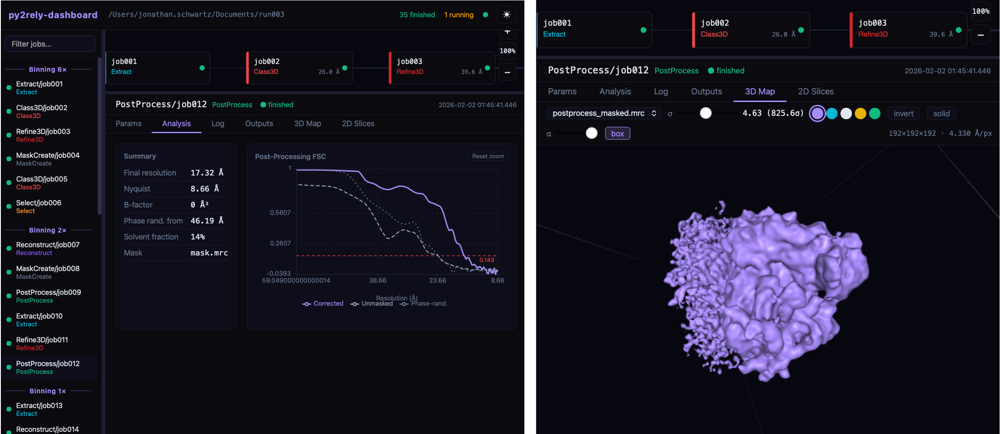

# The Relion Dashboard

`py2rely ui` is a browser-based pipeline visualizer and job monitor for RELION projects.
It shows the full job DAG, live status, logs, output files, and 3D density maps — all in one place.


*The py2rely dashboard showing the full RELION job graph, live job status, post-processing resolution analysis (FSC), and an interactive 3D density map viewer.*

---

## Installation

The dashboard requires a small set of additional dependencies that are not installed by default.
Install them with the `dashboard` extra:

`pip install ".[dashboard]"`

This adds **FastAPI**, **uvicorn**, and **watchdog** to your environment.
No Node.js or npm is required — the web interface is pre-built and shipped with the package.

---

## Launching

Run `py2rely ui` from inside your RELION project directory (the folder containing `default_pipeline.star`):

```bash
cd /path/to/my-relion-project
py2rely ui
```

The server starts on port **3000** and opens your browser automatically:

```
[py2rely-dashboard] Running at http://127.0.0.1:3000
```

!!! tip "No `default_pipeline.star` found?"
    If py2rely cannot find `default_pipeline.star` in the current directory it will exit with
    a helpful message. Make sure you `cd` into the RELION project root before running the command.

---

## Remote / HPC Usage

When running on an HPC cluster, bind to localhost (the default) and forward the port over SSH
from your local machine:

```bash
# On your laptop — open an SSH tunnel
ssh -L 3000:localhost:3000 your-hpc-host

# On the HPC node — start the server (no browser needed)
cd /path/to/my-relion-project
py2rely ui --no-browser --port=3000
```

Then open **http://localhost:3000** in your local browser.

!!! info "Exposing on all interfaces"
    If you need the UI accessible on the cluster network without a tunnel, pass `--host 0.0.0.0`.
    Only do this on a trusted network.

    ```bash
    py2rely ui --host 0.0.0.0 --no-browser
    ```

??? note "📝 Options for `py2rely ui`"
    ```bash
    py2rely ui [OPTIONS]
    ```

    | Option | Default | Description |
    |---|---|---|
    | `--port` | `3000` | Port to serve on |
    | `--host` | `127.0.0.1` | Host to bind to |
    | `--no-browser` | off | Suppress browser launch |
    | `--poll-interval` | `5` | Seconds between polls |