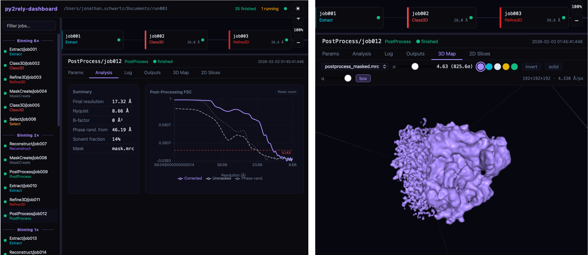

# The Relion Dashboard

`py2rely ui` is a browser-based pipeline visualizer and job monitor for RELION projects.
It shows the full job DAG, live status, logs, output files, and 3D density maps — all in one place.
It also includes an [interactive Mask Tuner](#interactive-mask-tuner) for designing MaskCreate masks.


*The py2rely dashboard showing the full RELION job graph, live job status, post-processing resolution analysis (FSC), and an interactive 3D density map viewer.*

---

## Installation

The dashboard requires a small set of additional dependencies that are not installed by default.
Install them with the `dashboard` extra:

`pip install ".[dashboard]"`

This adds **FastAPI**, **uvicorn**, and **watchdog** to your environment.
No Node.js or npm is required — the web interface is pre-built and shipped with the package.

---

## Launching

Run `py2rely ui` from inside your RELION project directory (the folder containing `default_pipeline.star`):

```bash
cd /path/to/my-relion-project
py2rely ui
```

The server starts on port **3000** and opens your browser automatically:

```
[py2rely-dashboard] Running at http://127.0.0.1:3000
```

!!! tip "No `default_pipeline.star` found?"
    If py2rely cannot find `default_pipeline.star` in the current directory it will exit with
    a helpful message. Make sure you `cd` into the RELION project root before running the command.

---

## Remote / HPC Usage

When running on an HPC cluster, bind to localhost (the default) and forward the port over SSH
from your local machine:

```bash
# On your laptop — open an SSH tunnel
ssh -L 3000:localhost:3000 your-hpc-host

# On the HPC node — start the server (no browser needed)
cd /path/to/my-relion-project
py2rely ui --no-browser --port=3000
```

Then open **http://localhost:3000** in your local browser.

The same tunnel works for the Mask Tuner — run `py2rely create-mask <map> --no-browser` on the
HPC node and open the printed URL locally.

!!! info "Exposing on all interfaces"
    If you need the UI accessible on the cluster network without a tunnel, pass `--host 0.0.0.0`.
    Only do this on a trusted network.

    ```bash
    py2rely ui --host 0.0.0.0 --no-browser
    ```

??? note "📝 Options for `py2rely ui`"
    ```bash
    py2rely ui [OPTIONS]
    ```

    | Option | Default | Description |
    |---|---|---|
    | `--port` | `3000` | Port to serve on |
    | `--host` | `127.0.0.1` | Host to bind to |
    | `--no-browser` | off | Suppress browser launch |
    | `--poll-interval` | `5` | Seconds between polls |

??? note "📝 Options for `py2rely create-mask`"
    ```bash
    py2rely create-mask INPUT_MAP [OPTIONS]
    ```

    `INPUT_MAP` is the density map (`.mrc`) to build a mask from; the tuner opens preloaded on it.

    | Option | Default | Description |
    |---|---|---|
    | `--port` | `3000` | Port to serve on |
    | `--host` | `127.0.0.1` | Host to bind to |
    | `--no-browser` | off | Suppress browser launch |

---

## Interactive Mask Create Job

The dashboard includes an interactive tuner for the **MaskCreate** job. It reimplements
RELION's `relion_mask_create` algorithm in Python so you can dial in mask parameters
and **see the resulting mask rendered over the input density map in 3D** before committing to a
full job.

### Opening the tuner

There are two ways in:

=== "CLI"

    Launch the tuner pointed straight at a density map. This works even outside a full RELION
    project — the positional argument is the input map you want to build a mask from:

    ```bash
    py2rely mask-create Refine3D/job021/run_class001.mrc
    ```

    The page opens preloaded on that map.

=== "Dashboard button"

    From a running `py2rely ui` dashboard, click the **Mask Tuner** button in the top bar.
    You then pick the input map from the dropdown (any 3D map produced in the pipeline) or
    paste a project-relative path.

??? note "Workflow"

    1. **Choose an input map** — from the pipeline dropdown or a pasted `.mrc` path (preselected when
    launched via `create-mask`).
    2. **Set the parameters** — these mirror the RELION MaskCreate job options:

        | Parameter | Description |
        |---|---|
        | **Lowpass filter (Å)** | Low-pass applied before binarization. `-1` disables. |
        | **Pixel size (Å)** | Pixel size for the low-pass filter. `-1` uses the map header value. |
        | **Binarization threshold** | Density threshold for the initial binary mask. |
        | **Extend mask (px)** | Grow (`>0`) or shrink (`<0`) the binary mask by this many pixels. |
        | **Soft edge width (px)** | Width of the raised-cosine soft edge. |
        | **Invert final mask** | Swap the masked-in and masked-out regions (`1 − mask`). |

        Hover the **?** next to any field for an inline explanation.

    3. **Click "Generate Mask"** — the new mask is computed and overlaid (purple) on the input map
    (gold) in the 3D viewer. Nothing recomputes until you click again, so tuning stays cheap.
    4. **Inspect and adjust** — re-run with new parameters as many times as you like.
    5. **Save** — write the mask to a path of your choice (defaults to `mask.mrc` in the project
    directory).

!!! tip "Picking the binarization threshold"
    RELION applies the threshold to the *low-pass-filtered* map. Click **Preview
    lowpass-filtered map** (below the Lowpass field) to display the filtered map, then drag the
    viewer's contour slider — it reads in **raw density units**, exactly the value
    `--ini_threshold` expects. Press **→ threshold** to copy the current contour straight into the
    binarization threshold field.

!!! info "What's written to the mask"
    The saved `mask.mrc` is a float32 map that inherits the input map's **voxel size, origin, and
    start indices**, with density statistics (`dmin/dmax/dmean/rms`) set in the header — so it
    stays aligned with the map it was built from, just like a real `relion_mask_create` output.
    The page also shows the equivalent `relion_mask_create` command line for reproducibility.